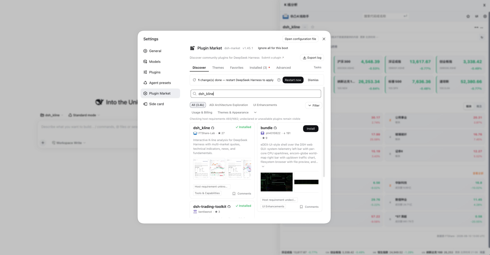

# dsh_kline

[简体中文](README.md) | English

An interactive K-line analysis plugin for [DeepSeek Harness](https://github.com/deepseek-ai/deepseek-harness). Ask in natural language to explore prices, technical indicators, news, and company fundamentals in a sidebar chart.

## Preview

## Plugin marketplace

`dsh_kline` is available in the DeepSeek Harness plugin marketplace. Search for `dsh_kline` or `kline` in Harness to install it. After a new release, refresh the marketplace from the same settings area to sync and update the installed plugin.

## Features

- **Multi-market quotes**: supports Hong Kong, US, and mainland China stocks. Search by company name, ticker, or code.
- **Search and watchlists**: search symbols, save the current symbol, and organize watchlists into groups with quote refresh, sorting, and batch opening. A star next to the symbol name favorites/unfavorites the current symbol with one click.
- **Interactive charts**: daily, weekly, monthly, quarterly, yearly, and intraday K-lines with zoom, pan, crosshair, and responsive layout.
- **Technical indicators**: switch K-line, volume, MA, MACD, KDJ, RSI, BOLL, ATR, and VWAP as needed.
- **Key levels**: when requested, identifies and annotates support, resistance, and touch counts.
- **Level annotations**: the “Levels” toolbar entry adds full-width level lines at any price or text markers on any candle (name/note/color; reprice, rename, or delete inline). Auto support/resistance can be repriced, renamed, deleted, or moved into your own locally persisted levels.
- **Range statistics**: click a start and end candle to inspect return, volatility, maximum drawdown, candle count, and trading activity.
- **Context**: browse stock news, company overview, financials, and shareholder information.

## How To Use

Enable `dsh_kline` in [DeepSeek Harness](https://github.com/deepseek-ai/deepseek-harness), then ask as you would an analyst. You do not need to memorize ticker formats.

- `Show the K-line chart for Zijin Mining`
- `Show Tencent's daily chart and mark support and resistance`
- `Analyze NVIDIA's volume, MACD, and RSI over the past month`
- `Show the latest news and fundamentals for this company`
- `Switch to the weekly chart and assess the trend`

After the analysis, use the sidebar to switch timeframes and indicators or explore news and company information. To view range statistics, click two candles in sequence.
Use the search box for a company name or ticker, then select the star to add it to a watchlist. Watchlists support groups, sorting, and batch opening, and are stored locally in the current browser.
The top-right Settings menu includes a Data source section where you can paste an FTShare API Key and test the connection. Without a key, mainland China daily, weekly, monthly, quarterly, and yearly bars remain available, along with indicators computed from them; Hong Kong and US daily bars, and minute bars for any market, depend on the permissions in the active FTShare tier. A key identifies the account but does not automatically grant every capability; news and realtime data follow the tier shown for each API. The key takes effect in the current dsh process; when saved locally, it is loaded again after restart. It is never echoed or stored in chart state, and `FTSHARE_API_KEY` can also override it. Other sources can continue to provide normalized rows through `analyze_kline_rows`.

## MCP Tools

| Tool | Purpose |
| --- | --- |
| `analyze_kline` | Main entry point. Returns quotes, indicators, chart data, and optional support/resistance analysis in one call. |
| `analyze_kline_rows` | Runs indicators, chart generation, and the sidebar session on caller-supplied normalized OHLCV rows without FTShare. |
| `fetch_candles` | Retrieves normalized OHLCV candle data. |
| `calc_metrics` | Calculates technical and statistical metrics from OHLCV data. |
| `data_source_status` | Returns safe provider installation, configuration, and capability status for the Settings UI. |
| `configure_ftshare` | Configures or clears an FTShare API Key, can save it locally and test it without returning the key. |
| `test_ftshare_connection` | Tests the current anonymous/API-key FTShare connection without changing configuration. |
| `health` | Checks service and data-adapter health. |

Most requests only need `analyze_kline`. The other tools are available for raw data, standalone calculations, and health checks.

## Data Sources

FTShare is an optional default adapter, not a hard dependency of the analysis engine. Access is tiered: a key identifies the account, but it does not grant every API capability. Without FTShare, without a key, or when the upstream is unavailable, callers can pass their own OHLCV rows to `analyze_kline_rows` and keep using indicators, key levels, charts, and the sidebar workspace.

External sources only need `time` (Unix seconds or milliseconds), `open`, `high`, `low`, `close`, and `volume`. dsh_kline sorts, deduplicates, and validates these rows; it does not require registration with a particular provider. `data_source_url` accepts HTTPS links for source attribution.

The FTShare adapter uses only explicitly reviewed official API contracts. Daily and historical minute candles may use a bounded SDK/official-path fallback and record the transport used; authentication, plan limits, and rate limits never trigger blind endpoint guessing. Before upgrading the SDK, follow “official docs → SDK signature and parameters → redacted live check → regression tests”; see the [provider adaptation guide](docs/provider-adaptation.md).

For a minimal integration, obtain rows in the host or provider adapter and call `analyze_kline_rows(rows=rows, symbol="BTCUSDT", name="Example asset", data_source="Custom market source", data_source_url="https://example.com")`. News, company data, and market tickers can be supplied separately through the normalized workspace payload.

Symbol lookup is owned by dsh_kline's local security directory and does not call FTShare's search endpoint. The directory refreshes in the background, so users select a symbol first and only then request candles. Minute bars, news, and broader market data depend on the capabilities and permissions of the active source; they do not affect the external OHLCV analysis path.

## Data And Usage Notes

- Quotes may be delayed, market-closed, or affected by upstream availability.
- Support, resistance, and indicators are historical technical analysis only and are not investment advice.
- Commercial, high-frequency, or latency-sensitive use should rely on properly licensed data with an appropriate service level.

## Updates

See [Releases](https://github.com/FTShare-Lab/dsh_kline/releases) for the changelog. The sidebar displays an update notice when a newer stable release is available. Source users can update to the latest version and restart Harness.

## License

Released under the [MIT License](LICENSE). Frontend provenance is documented in [PROVENANCE.md](PROVENANCE.md).
