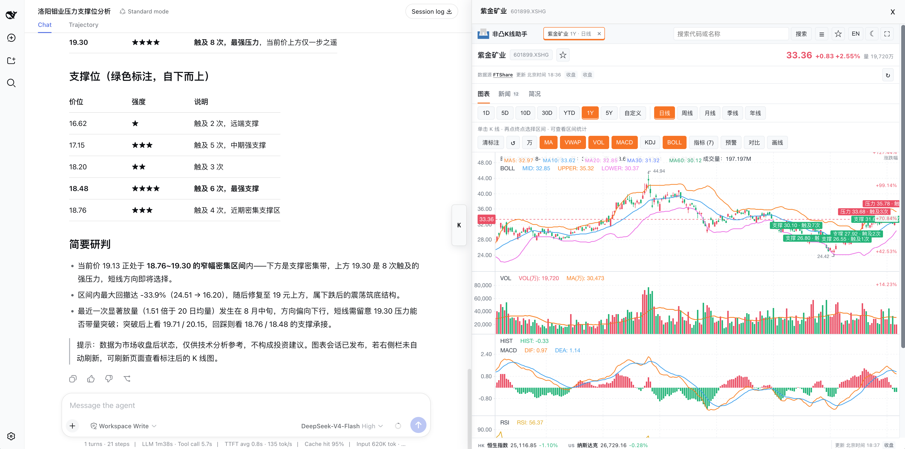

# dsh_kline

面向 [DeepSeek Harness](https://github.com/deepseek-ai/deepseek-harness) 的交互式
K 线分析插件，可通过自然语言完成行情分析并在右侧栏查看图表。



## 功能

- 支持港股、美股和 A 股
- 展示 K 线、成交量、MA、MACD、KDJ、RSI、BOLL、ATR 和 VWAP
- 自动分析并标注支撑位、压力位和触及次数
- 提供个股新闻、公司简况和基本面信息
- 支持缩放、拖动、十字线、时间范围和周期切换
- 点击起点和终点 K 线即可查看区间涨跌、成交量和波动统计
- 适配桌面端和移动端布局

## 使用

在 DeepSeek Harness 中启用 `dsh_kline` 后，直接用自然语言提问，例如：

```text
分析 00700.HK 最近 60 根日 K，显示 MA、成交量、MACD、RSI、BOLL、ATR 和 VWAP，
标注支撑位和压力位，并用中文总结趋势。
```

也可以继续询问：

```text
查看 NVDA.US 的周线趋势和关键压力位。
分析 600519.XSHG 的成交量、MACD 和 RSI。
查看这只股票最近的新闻和基本面信息。
```

分析结果和交互式图表会显示在 Harness 右侧栏，可直接切换指标、周期、新闻和简况。

## 数据源

[FTShare Python SDK](https://github.com/FTShare-Lab/FTShare-python-sdk) 是推荐的可选
数据源，`dsh_kline` 已针对港股、美股和 A 股数据做了适配。

指标与图表使用标准 OHLCV 结构，也可以接入其他数据源。

## 许可证

指标实现和交互式前端参考了 MIT 许可的 `ft-kline-view`，详见
[docs/PROVENANCE.md](docs/PROVENANCE.md)。本项目采用 [MIT License](LICENSE)。
