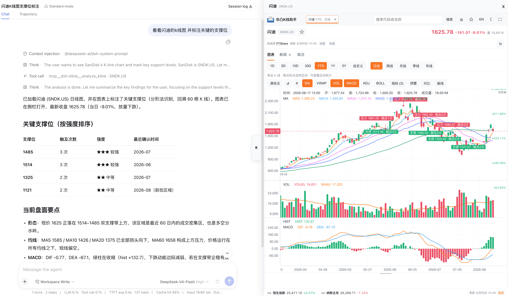
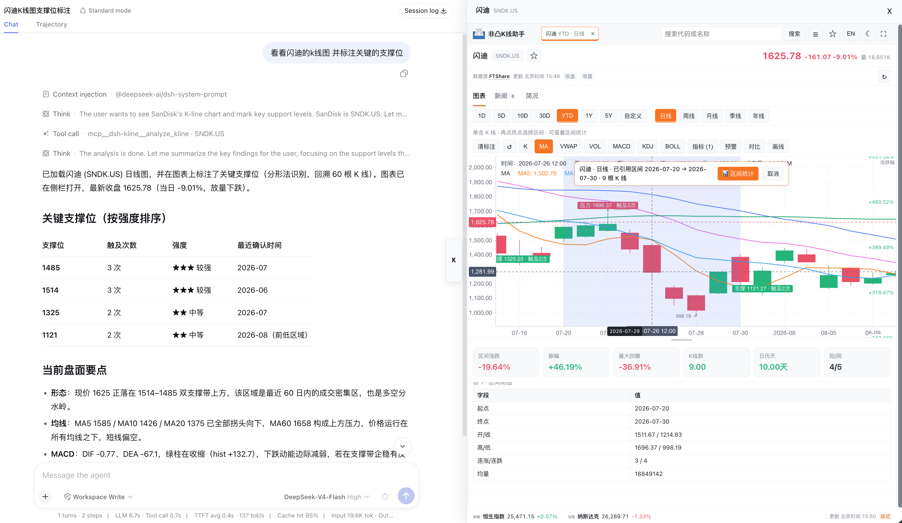
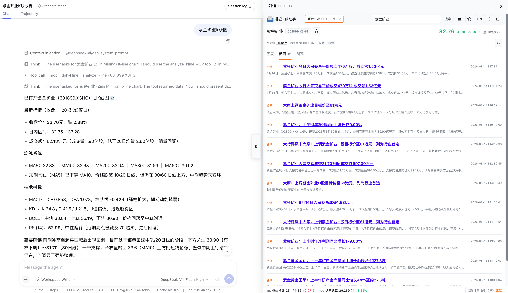

# dsh_kline

面向 [DeepSeek Harness](https://github.com/deepseek-ai/deepseek-harness) 的 K 线分析插件，支持直接用自然语言查看行情、指标、新闻和基本面信息。

## 预览

## 能做什么

- 支持港股、美股和 A 股
- 可直接输入股票名称、简称或代码
- 查看 K 线、成交量、MA、MACD、KDJ、RSI、BOLL、ATR、VWAP
- 自动标注支撑位、压力位
- 点击两根 K 线查看区间统计
- 查看新闻、简况和基本面信息

## 怎么用

在 [DeepSeek Harness](https://github.com/deepseek-ai/deepseek-harness) 中启用 `dsh_kline` 后，直接说出你的需求即可，例如：

- `调取紫金矿业的 K 线`
- `看看腾讯控股的日 K，标注压力位和支撑位`
- `查看这只股票最近的新闻和基本面信息`

## 数据源

推荐使用 [FTShare Python SDK](https://github.com/FTShare-Lab/FTShare-python-sdk)，也支持其他符合 OHLCV 结构的数据源。

## 说明

行情可能延迟或已收盘，图中内容仅供参考，不构成投资建议。

## 许可

本项目采用 [MIT License](LICENSE)，前端来源说明见 [docs/PROVENANCE.md](docs/PROVENANCE.md)。
