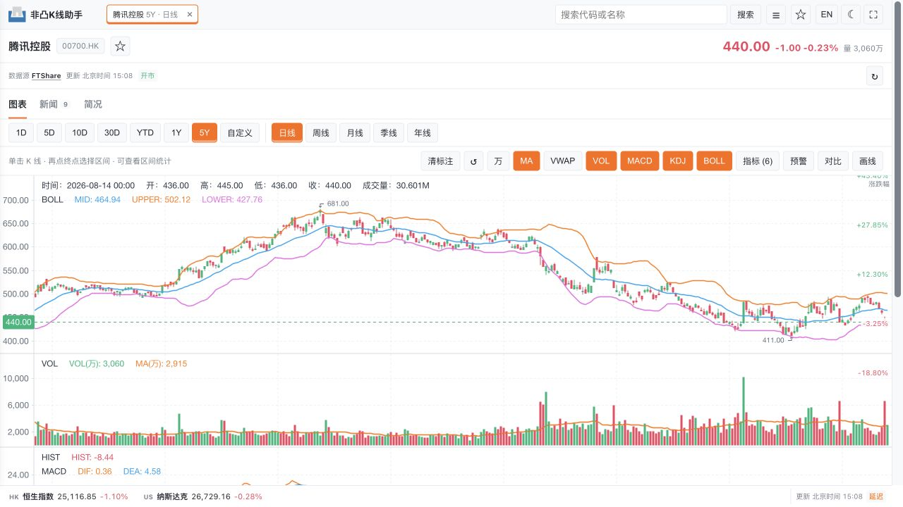
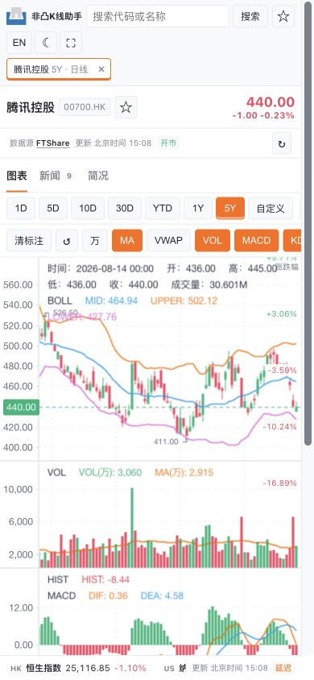

# dsh_kline

`dsh_kline` 是面向 [DeepSeek Harness](https://github.com/deepseek-ai/deepseek-harness)
的独立 K 线分析 MCP。项目默认接入
[FTShare Python SDK](https://github.com/FTShare-Lab/FTShare-python-sdk)，并针对其
市场代码、历史行情限制和多市场数据结构进行了适配。

一次 `analyze_kline` 调用即可完成数据获取、指标计算和图表生成。项目不依赖
FTShare-MCP、`ft-kline-view` 或其他外部 K 线 MCP 服务。

## 界面预览





以上截图展示图表、成交量、MA、MACD、BOLL、缩放和响应式布局。截图中的行情
仅用于展示界面，实际数据由配置的数据源实时获取。

## 功能

- 支持港股、美股和 A 股日线分析
- 提供 MA、成交量、MACD、KDJ、RSI、BOLL、ATR、VWAP
- 提供缩放、拖动、十字线和响应式交互式图表
- 图表可切换 10D、30D、YTD、1Y、5Y 等范围
- 通过本机临时 URL 查看图表，数据只保存在内存中
- 指标计算采用统一 OHLCV 数据结构，可接入自有数据源

## 环境要求

- Node.js `>=22.19.0`
- pnpm `11.7.0`
- Python `>=3.10`
- DeepSeek API Key

## 安装

```bash
git clone https://github.com/FTShare-Lab/dsh_kline.git
cd dsh_kline
pnpm install --frozen-lockfile
./scripts/bootstrap.sh
```

`bootstrap.sh` 会创建 `.venv` 并安装固定版本的 Python 依赖和 FTShare SDK。

## 启动

```bash
pnpm dsh:web
```

按终端输出的地址打开 dsh Web，进入 **Settings -> Models** 配置 DeepSeek API
Key，然后选择 `dsh_kline` workspace。

也可以通过环境变量提供 Key：

```bash
export DEEPSEEK_API_KEY='your_key_here'
pnpm dsh:web
```

API Key 只能保存在本机，不要提交到 Git。

## 使用

在 dsh Web 中直接输入，例如：

```text
分析 00700.HK 最近 60 根日 K，显示 MA、成交量、MACD、RSI、BOLL、ATR 和 VWAP，
用中文总结趋势并提供交互式图表链接。
```

推荐始终使用单次调用工具：

```text
mcp__dsh-kline__analyze_kline
```

分析结果会返回文字摘要和 `chart_url`。在浏览器中打开该 URL 即可查看交互式图表。

图表服务仅监听本机回环地址，并自动返回当前可用地址。图表会话保留 6 小时，
dsh 进程退出后失效。

## MCP 工具

| 工具 | 用途 |
| --- | --- |
| `analyze_kline` | 获取行情、计算指标并生成图表，推荐使用 |
| `fetch_candles` | 获取标准化 OHLCV 数据 |
| `calc_metrics` | 计算调用方提供数据的指标摘要 |
| `health` | 检查 Python 和 FTShare SDK 状态 |

## 数据源

默认数据源是 [FTShare Python SDK](https://github.com/FTShare-Lab/FTShare-python-sdk)。
`fetch_candles` 和 `analyze_kline` 已针对 FTShare 的港股、美股、A 股代码规范、
复权参数和历史数据分页进行了优化。

指标层不绑定 FTShare。`calc_metrics` 可以直接接收其他数据源生成的标准 OHLCV：

```json
{
  "time": 1719792000,
  "open": 100.0,
  "high": 105.0,
  "low": 99.0,
  "close": 103.0,
  "volume": 1200000
}
```

`time` 使用 Unix 秒，其余字段为数值。要让 `analyze_kline` 自动从自有数据源取数
并支持图表范围切换，可在 `tools/fetch.py` 中扩展适配器，只需继续输出相同的标准
OHLCV 结构，无需增加另一个 MCP 服务。

## 验证

```bash
pnpm smoke:mcp
.venv/bin/python -m pytest -q
pnpm smoke:live
pnpm smoke:markets
```

- `smoke:mcp`：检查 4 个 MCP 工具是否可发现
- `smoke:live`：验证真实港股分析和图表 URL
- `smoke:markets`：验证港股、美股、A 股及错误输入

真实行情测试需要能够访问 FTShare 服务。

## 当前限制

- 港股分钟 K 线尚未经过 FTShare SDK 验证，建议使用日线及以上周期
- 部分 A 股宽基指数缺少已验证的历史行情接口，系统会明确返回错误

## 安全

- 不要提交 API Key、凭据文件、dsh 会话或生成的行情数据
- 曾粘贴到聊天、Issue 或终端日志中的 Key 应立即轮换
- `DSH_KLINE_CACHE_DIR` 可能包含证券元数据，不应公开

## 来源与许可证

指标实现和交互式前端基于 MIT 许可的 `ft-kline-view` 改造，但本项目运行时不依赖
该仓库。详细来源见 [docs/PROVENANCE.md](docs/PROVENANCE.md)。

本项目采用 MIT 许可证，见 [LICENSE](LICENSE)。
