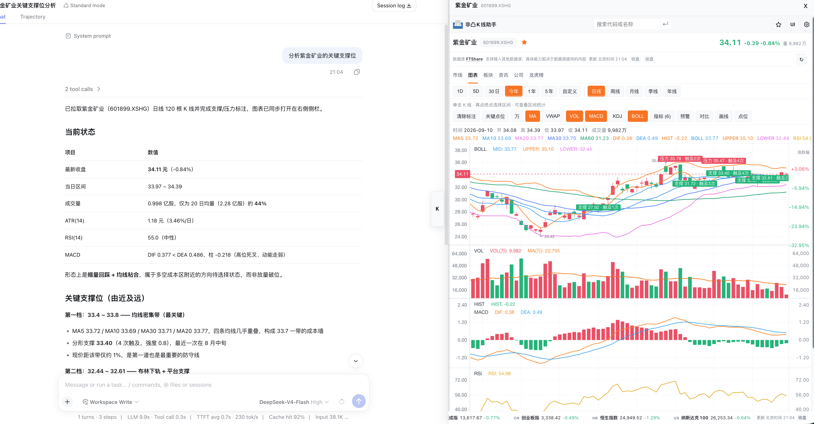

# 非凸 K 线助手 / dsh_kline

简体中文 | [English](README.en.md)

在 DeepSeek Harness 里看行情、读图表、找关键价位。你可以直接问 AI，也可以自己搜索标的、切换周期和指标，把 K 线当作一个随时可打开的工作台。

> 行情与技术分析用于研究和学习，不构成投资建议。

## 它能帮你做什么

- **一句话开始分析**：直接说“看看紫金矿业最近一个月趋势”或“分析英伟达的 MACD 和 RSI”。
- **自己动手看图**：打开 K 线工作台，搜索名称或代码，随时切换日、周、月、季、年和可用的分钟周期。
- **看清趋势与信号**：支持 MA、成交量、MACD、KDJ、RSI、BOLL、ATR、VWAP 等常用指标。
- **寻找价格区域**：一键分析支撑位和压力位；也可以自己画水平价位线、添加备注，并在本机保存。
- **比较与复盘**：叠加指数或标的、框选两个时间点查看涨跌、振幅、回撤和成交统计。
- **补充研究信息**：在“市场、板块、资讯、公司、龙虎榜”中浏览指数、板块排行、资金异动、新闻、公司画像、财务与股东信息。
- **建立自己的关注列表**：收藏标的、建立或重命名分组、排序、导入或批量打开；自选会作为你的用户级数据跨对话保留。

## 预览




## 开始使用

### 1. 安装并启用

在 DeepSeek Harness 的插件市场搜索 `dsh_kline`。如果市场目录还没有刷新，可以直接从 GitHub 安装：

```bash
dsh plugin --profile web add github:FTShare-Lab/dsh_kline
```

首次启动会自动准备所需运行环境。以后有新版本时，在插件市场或设置页更新即可。

插件支持 macOS、Linux 和原生 Windows。用户需要先安装可运行的 DSH Web，以及 Python 3.10 或更高版本；Windows 推荐使用 [python.org](https://www.python.org/downloads/windows/) 安装包并启用 Python Launcher。插件不要求 Git Bash 或 WSL。首次启动的依赖安装日志位于用户缓存目录下的 `dsh_kline/bootstrap.log`；Windows 默认为 `%LOCALAPPDATA%\dsh_kline\bootstrap.log`。


### 2. 任选一种入口

**和 AI 对话**：在对话中提出需求，例如：

- `调取紫金矿业的 K 线，看看最近一个月走势`
- `分析腾讯控股日 K，标注支撑位和压力位`
- `查看英伟达最近一个月的成交量、MACD 和 RSI`
- `这只股票最近有什么新闻和基本面变化？`

**直接打开工作台**：点击右侧 K 按钮，或在支持工作台 Tab 的界面从 `+` 菜单选择 **非凸 K 线助手 / dsh_kline**。输入股票名称或代码即可开始，不需要记住交易所后缀。

两种入口打开的是同一个图表能力。每个对话各自保存图表状态，避免不同对话之间串图；自选与分组属于你的用户级数据，会跨对话保留；标注与当前图表视图仍按对话隔离。

## 图表怎么用

1. 用顶部搜索框输入标的名称或代码。
2. 选择时间范围和 K 线周期；分钟线是否可用取决于数据权限和市场。
3. 开启需要的指标，拖动、缩放或使用十字线查看细节。
4. 点击 **关键点位** 识别支撑和压力；点击 **点位** 添加自己的价位线或文字标注。
5. 依次点击两根 K 线，查看这段区间的涨跌、振幅、回撤与成交统计。
6. 点击名称旁的星标，把标的放进自选。

如果界面提供 **UI** 入口，可按习惯选择自动、独立侧栏或工作台 Tab。自动模式会使用当前 Harness 能提供的最佳界面；没有工作台 Tab 框架时，仍可正常使用右侧 K 线侧栏。

## 行情与数据源

默认可接入 FTShare。配置 API Key 后，插件会根据你的账户权限提供相应的行情、分钟线、新闻和公司资料能力；不同市场和套餐的可用范围可能不同。

在右上角 **设置 → 数据源** 粘贴 FTShare API Key，并点击测试连接即可。Key 不会显示在图表、对话内容或导出的状态中；可选择仅本次使用，或保存到本机供下次启动加载。

没有配置 Key 时，部分公开行情与图表能力仍可使用。遇到数据延迟、收盘、权限不足或上游暂不可用，界面会说明实际原因和数据来源。

## 常见问题

**为什么找不到分钟线？**
分钟行情是否可用取决于标的市场、账户套餐和数据源当前支持范围。请先在“数据源”中测试连接；日、周、月等周期不受此限制。

**Windows 首次启动失败怎么办？**

先在终端执行 `py -3.10 --version`（更高版本也可以），确认 Python Launcher 能找到 Python。然后查看 `%LOCALAPPDATA%\dsh_kline\bootstrap.log`；如果 Python 安装在自定义位置，可在启动 DSH Web 前设置 `DSH_KLINE_PYTHON` 为 `python.exe` 的完整路径。DSH Web 本身的安装或 Windows sandbox 问题需要参考 DSH 官方文档。

**为什么两个对话显示不同的图？**
这是刻意设计：图表会绑定各自对话，避免 A 对话的分析覆盖 B 对话。需要在另一个对话查看时，直接搜索或重新发起分析即可。

**为什么同一标的的数据与其他平台略有不同？**
行情可能延迟，也会受复权方式、交易所口径、收盘状态和上游服务影响。商业、高频或对时效有严格要求的场景，请使用有相应授权与服务等级的数据源。

## 给 AI 与开发者

大多数场景只需调用 `analyze_kline`。插件还提供 `fetch_candles`、`search_symbols`、`calc_metrics`、`analyze_kline_rows`、`data_source_status`、`configure_ftshare`、`test_ftshare_connection` 和 `health`，用于原始数据、外部 OHLCV、配置与诊断。

FTShare 只是默认适配器，不是分析引擎的前提。调用方可以把自己的标准 OHLCV 数据交给 `analyze_kline_rows`，继续使用指标、关键点位、图表和工作台。接入说明见 [数据源适配指南](docs/provider-adaptation.md)。

## 更新与许可

更新记录见 [Releases](https://github.com/FTShare-Lab/dsh_kline/releases)。本项目采用 [MIT License](LICENSE)，前端来源说明见 [PROVENANCE.md](PROVENANCE.md)。
